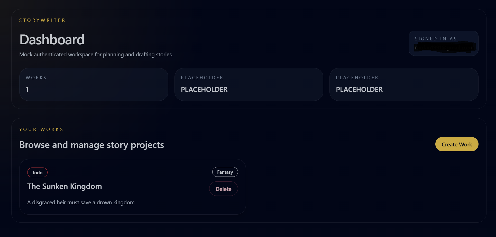

# StoryWriter

StoryWriter is a browser-based story planning and drafting app built as a monorepo with a Next.js frontend and a FastAPI backend.

It is designed for long-form fiction workflows: managing works, scenes, characters, and related story structure in one place.

## Screenshot




## Stack

- Frontend: Next.js 15, React, TypeScript, Tailwind CSS
- Backend: FastAPI, Python, SQLAlchemy, Pydantic
- Database: SQLite by default for local development

## Current Features

- Works: create, read, update, and delete works via the backend API and frontend workspace screens.
- Scenes: per-work scene listing, create, retrieve, update, delete, and reordering (backend endpoints and frontend screens).
- Characters: per-work character CRUD and reordering endpoints, with matching frontend components.
- Status tags: tag listing, creation, update, and deletion with per-user default status tags (Todo / In Progress / Done).
- Authentication: `GET /api/auth/me` plus frontend sign-in flows (Supabase-backed token handling and session helpers).
- Health & OpenAPI: simple `/api/health` health check and an OpenAPI JSON snapshot in `backend/tests/openapi.json`.
- Tests: integration/unit tests around auth and API routes under `backend/tests/`.
- Architecture: shared frontend API helper, repository/service layering on the backend, and a structure that keeps domain logic separate from persistence.

## Repository Layout

- `frontend/` - Next.js application
- `backend/` - FastAPI application
- `Documentation/` - design notes and technical planning
- `start-dev.bat` - convenience script to launch both apps locally

## Prerequisites

- Node.js 18+ or 20+
- Python 3.11+
- Git

## Local Setup

### Frontend

```bash
cd frontend
npm install
```

### Backend

```bash
cd backend
python -m venv .venv
.venv\Scripts\activate
pip install -U pip
pip install .
```

## Running Locally

### Option 1: Use the helper script

From the repository root:

```bash
start-dev.bat
```

This starts the backend on port 8000, the frontend on port 3000, and opens the app in your browser.

### Option 2: Run each app manually

Backend:

```bash
cd backend
.venv\Scripts\activate
python -m uvicorn app.main:app --reload --port 8000
```

Frontend:

```bash
cd frontend
npm run dev
```

Then open:

- Frontend: http://localhost:3000
- Backend API: http://localhost:8000

## Environment

The backend reads settings from `backend/.env` when present.

Useful settings include:

- `DATABASE_URL` - SQLAlchemy database URL
- `SECRET_KEY` - application secret
- `FRONTEND_ORIGIN` - allowed frontend origin for local development

By default, the backend uses a local SQLite database file.

## Development Notes

- The frontend uses the App Router and client components for the main workspace screens.
- The backend keeps domain logic in services and persistence behind repository interfaces.
- The project is structured so SQLite can later be replaced with PostgreSQL with minimal code changes.

## License

No license file is currently included.
